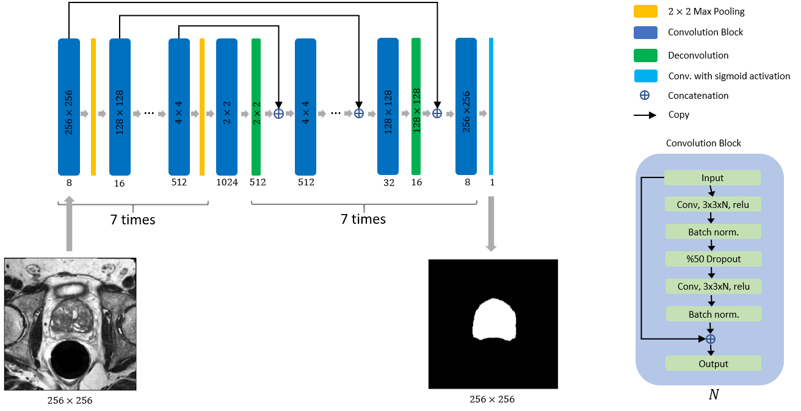

# PROMISE12 Challenge - Automated Segmentation of Prostate Structures from MR Images

This is Keras implementation of a fully convolutional neural network with residual connections for automatic segmentation of prostate structures from MR images.

More info on this competition can be found on [Grand Challenges website](https://promise12.grand-challenge.org/). Data can be downloaded from [https://promise12.grand-challenge.org/download/](https://promise12.grand-challenge.org/download/)

The network architecture was inspired by [U-Net: Convolutional Networks for Biomedical Image Segmentation](http://lmb.informatik.uni-freiburg.de/people/ronneber/u-net/) and by Keras implementation of the model by [Paul-Louis Pröve](https://github.com/pietz).

The predictions of this model achieved the score **83.70** and was ranked **#8** in the competition. For more details about the model and the implementation see the file `project_summary.pdf`



## How to use

### Dependencies

This tutorial depends on the following libraries:

* scikit-image, numpy, matplotlib, scipy
* SimpleITK
* OpenCV
* Tensorflow >=1.4
* Keras >= 2.0

This code should also be compatible with Theano backend of Keras, but in my experience Theano is slower than TensorFlow.

### Running the model

* Run ```python train.py``` to pre-process the data and train the model.
Model weights are save in  file ```../data/weights.h5 ```.

* Run ```python test.py``` to test the model on the train and validation set and generate some images with some best and worst predictions.
